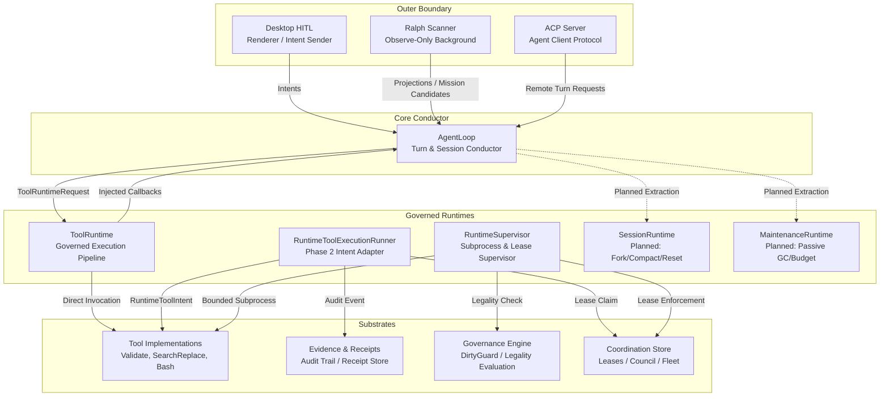
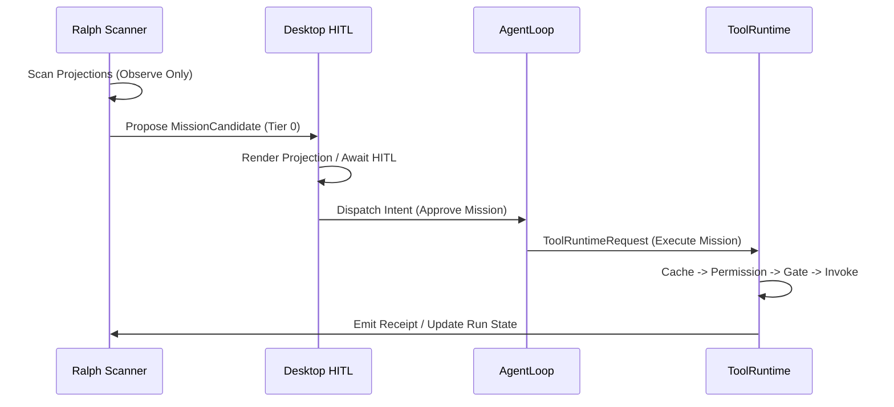

# Rig Relay: Deep Architectural Seam Analysis

This document provides a comprehensive architectural seam analysis of the Rig Relay core engine, evaluating the boundaries between `AgentLoop`, its surrounding runtime authorities (`ToolRuntime`, `RuntimeToolExecutionRunner`, `RuntimeSupervisor`), the observe-only background scanner (`Ralph`), the human-in-the-loop surface (`Desktop HITL`), and external protocol adapters (`ACP` / `MCP`). 

---

## 1. Executive Summary & Seam Overview

Rig Relay is currently in an architectural transition from a monolithic orchestrator (`AgentLoop`) to a modular, governed runtime ecosystem. The established governance doctrine mandates that `AgentLoop` act strictly as a **turn and session conductor**, delegating all domain policy, tool execution authority, and lifecycle management to specialized runtime boundaries.



### Key Findings
1. **Dual Tool Execution Pipelines**: The codebase currently maintains two parallel, un-unified tool execution paths: `ToolRuntime` (used by `AgentLoop` via dependency-injected closures) and `RuntimeToolExecutionRunner` (used by Phase 2 intent adapters with direct tool class instantiation and lease acquisition).
2. **Incomplete Runtime Extractions**: While `ToolRuntime` has been extracted into a standalone class, `AgentLoop`'s mixins (`GovernanceMixin`, `TelemetryMixin`, `ToolResponseMixin`) still house the concrete implementations of the execution gates. Furthermore, `SessionRuntime` and `MaintenanceRuntime` remain unextracted, leaving `AgentLoop` burdened with session manipulation (`fork`, `compact`, `clear_history`) and passive garbage collection (`_maybe_auto_gc`).
3. **Deferred Supervision**: `RuntimeSupervisor` provides robust, lease-gated, bounded subprocess execution with stall detection, but its integration into `RuntimeToolExecutionRunner` is currently marked as deferred.
4. **Contract-Only Background Isolation**: Ralph operates safely as an observe-only (Tier 0) scanner with `execution_enabled=False`. Its integration with `ToolRuntime` for automated maintenance missions remains defined via contracts and schemas rather than active execution wiring.

---

## 2. Deep Seam Analysis: The Dual Tool Execution Pipelines

A critical architectural seam in Rig Relay lies between `AgentLoop`'s tool invocation mechanism and the standalone runtime packages. Currently, tool execution is split across two distinct paradigms.

### A. The AgentLoop / ToolRuntime Pipeline (`rig_relay/core/tool_runtime.py`)
`ToolRuntime` was extracted to establish a governed, vertical tool execution boundary. It orchestrates a strict nine-stage sequence:
1. **Cache Check**: Inspects previous tool responses.
2. **Permission Check**: Enforces `ToolPermission` rules (`ALWAYS`, `ASK`, `NEVER`).
3. **Approval Request**: Interacts with HITL gating.
4. **Patch Gate**: Enforces patch proposal requirements for mutation tools.
5. **Invoke Tool**: Executes the tool stream generator.
6. **Receipt Capture**: Builds and records content-addressed receipt envelopes.
7. **Cache Store**: Persists successful results.
8. **Context Observation**: Emits workspace context observations.
9. **Result Classification**: Wraps outcomes in a typed `ToolRuntimeResult`.

> [!WARNING]
> **Coupling Leak**: Although `ToolRuntime` isolates the sequence, `AgentLoop._get_tool_runtime()` injects 11 closures (`invoke_adapter`, `cache_check`, `permission_decision`, `approval_request`, `patch_gate_check`, `expand_args`, `receipt_build`, `receipt_capture`, `context_observe`, `stats_delta`) that bind directly back to `AgentLoop` methods and mixins. Consequently, modifying permission, caching, or observation policy still requires editing `AgentLoop` mixins.

```diff
# Current conceptual coupling in AgentLoop._get_tool_runtime
- runtime = ToolRuntime(
-     permission_decision=self._permission_decision_adapter,
-     approval_request=self._approval_request_adapter,
-     ...
- )
# Target decoupled architecture
+ runtime = ToolRuntime(
+     permission_store=self.governance_engine.permissions,
+     approval_dispatcher=self.desktop_context.approval_dispatcher,
+     ...
+ )
```

### B. The Runtime Intent Adapter Pipeline (`rig_relay/runtime/tool_invocation_execution.py`)
Operating independently of `AgentLoop`, `RuntimeToolExecutionRunner` provides an execution path for structured intents (`validate`, `search_replace`, `write_file`, `bash`).
* **Workflow**: It consumes a `RuntimeToolIntent`, prepares a `RuntimeToolInvocationEnvelope` via `RuntimeToolInvocationAdapter`, validates the payload against JSON schemas (`rig.relay.runtime_tool_invocation.v1.schema.json`), claims a mutation lease from the coordination store (`_claim_mutation_lease`), instantiates the concrete tool class (`Validate`, `SearchReplace`, `WriteFile`, `Bash`), executes it, attaches receipts, and persists a `RuntimeAuditEvent`.
* **Seam Disconnect**: This path bypasses `ToolRuntime` entirely. It duplicates receipt building logic (`_build_tool_receipt`) and executes tools directly without passing through `ToolRuntime`'s permission or patch gating sequences.

### C. The RuntimeSupervisor Substrate (`rig_relay/runtime/supervisor.py`)
`RuntimeSupervisor` is a hardened, lease-gated subprocess execution engine ported from the legacy Rig domain.
* **Capabilities**: It executes commands via `asyncio.create_subprocess_exec` (avoiding shell injection risks), drains `stdout`/`stderr` concurrently into bounded buffers (default 64KB), enforces timeouts and stall detection warnings, verifies action legality via `GovernanceEngine`, and emits content-light `ReceiptEnvelope` summaries.
* **Seam Disconnect**: `RuntimeToolExecutionRunner` explicitly notes: `Constraints: RuntimeSupervisor integration is deferred.` Currently, built-in tools like `Bash` manage their own subprocess execution, missing out on `RuntimeSupervisor`'s advanced buffer management and stall termination.

---

## 3. AgentLoop vs. Future Planned Runtimes

The `agent-loop-boundary.md` governance doctrine defines an explicit extraction roadmap for `AgentLoop` to prevent it from becoming a monolithic "runtime kernel."

| Component | Target Location | Current Implementation State | Architectural Seam Assessment |
|---|---|---|---|
| **ToolRuntime** | `rig_relay/core/tool_runtime.py` | Extracted into standalone class; instantiated in `AgentLoop._get_tool_runtime()`. | **Partial Extraction**: Pipeline sequence is isolated, but policy implementations remain tightly coupled to `AgentLoop` mixins. |
| **SessionRuntime** | `rig_relay/core/session_runtime.py` | Unextracted. Methods remain directly on `AgentLoop` (`fork`, `compact`, `reset`, `clear_history`, `switch_agent`, `reload`). | **High Coupling**: `AgentLoop` directly manipulates message history, initializes new `AgentLoop` instances for forks, and triggers dirty guard recaptures. |
| **MaintenanceRuntime** | `rig_relay/core/maintenance_runtime.py` | Unextracted. `AgentLoop._maybe_auto_gc()` directly triggers storage lifecycle checks after tool execution. | **Moderate Coupling**: `_maybe_auto_gc()` correctly delegates to `storage_lifecycle.py`, but the invocation trigger remains embedded in the core turn loop. |

---

## 4. Ralph vs. ToolRuntime vs. Desktop HITL Boundary

The interactions between the background scanner (`Ralph`), the desktop cockpit (`Desktop HITL`), and the execution engine represent a clean, contract-driven architectural seam.



### A. Ralph Background Scanner (`rig_relay/ralph/`)
* **Role**: Observe-only scanner that reads projections from `.rig/reports/indexes/` and `.rig/analytics/bash/indexes/`, ranks candidates, and generates `MissionCandidate` proposals.
* **Seam Enforcement**: Ralph is strictly isolated to Tier 0. It never mutates files or invokes tools directly. All active execution paths in Ralph currently enforce `execution_enabled=False`, routing approved tasks to `execution_pending_implementation`.

### B. Desktop HITL Boundary (`rig_relay/desktop/`)
* **Role**: Renders diagnostic projections and captures human approval for pending missions, tool permission escalations (`ASK`), and patch proposals.
* **Seam Enforcement**: The desktop cockpit is a pure renderer and intent dispatcher. It holds no execution policy, ensuring that if the desktop UI is disconnected, the core `AgentLoop` remains fully functional via CLI or ACP.

---

## 5. Protocol Boundaries: ACP & MCP

### A. Agent Client Protocol (ACP)
* **Architecture**: Located in `rig_relay/acp/` and `rig_relay/protocols/acp/`. ACP provides a remote RPC mechanism for driving agent sessions.
* **Seam**: It implements a dedicated `acp_agent_loop.py` which wraps `AgentLoop`. While `AgentLoop` handles turn conduction, ACP manages the external transport, protocol deserialization, and remote telemetry streaming.

### B. Model Context Protocol (MCP)
* **Architecture**: Located in `rig_relay/protocols/mcp/` and `rig_relay/core/tools/mcp/`.
* **Seam**: MCP acts as a dynamic capability discovery bridge. `AgentLoop._complete_init()` inspects configured MCP servers (e.g., `anigma-mcp`) and dynamically registers external tools (such as `read_file`, `swift_build`, `context_search`) into the `ToolManager`, seamlessly expanding the agent's surface without hardcoding tool definitions.

---

## 6. Synthesis of Open Out-of-Scope Findings

An audit of `docs/findings/out-of-scope-findings.jsonl` reveals 10 open findings that directly map to the architectural seams identified in this analysis. Resolving these findings is critical for achieving a clean, decoupled runtime architecture.

| Finding ID | Architectural Seam / Domain | Description & Impact | Recommended Remediation |
|---|---|---|---|
| `finding_20260514_agent_loop_runtime_kernel` | Core Conductor vs. Runtimes | `AgentLoop` has >10 independent reasons to change, acting as a monolithic kernel rather than a turn conductor. | Complete the extraction of `ToolRuntime`, `SessionRuntime`, and `MaintenanceRuntime`. |
| `finding_20260514_tool_execution_pipeline_boundary` | Tool Execution | Tool execution logic is scattered across `AgentLoop` and 3 mixins. (Note: `ToolRuntime` class exists but mixin coupling remains). | Decouple `ToolRuntime` callbacks from `AgentLoop` mixins; unify with `RuntimeToolExecutionRunner`. |
| `finding_20260514_deferred_init_race` | Conductor Initialization | `AgentLoop` supports `defer_heavy_init=True` but lacks an explicit readiness guard in `act()`, risking race conditions. | Add an explicit `wait_until_ready()` guard in `act()` and `_conversation_loop()`. |
| `finding_20260517_validate_check_missing_dependency_bug` | Tool Substrate (`Validate`) | `check_missing_dependency()` checks all `argv` tokens with `shutil.which()`, incorrectly blocking multi-word commands like `git status`. | Modify dependency check to inspect only the first non-flag, non-runner token in `argv`. |
| `finding_20260513_dirty_guard_singleton` | Governance (`DirtyGuard`) | `DirtyFileGuard` singleton is shared across forked agents, causing cross-session state corruption. | Transition `DirtyFileGuard` to a session-scoped instance managed by `GovernanceEngine`. |
| `finding_20260513_clear_history_recaptures_guard` | Session Lifecycle | `clear_history()` recaptures dirty guard state instead of preserving the conversation-only snapshot. | Refactor `clear_history()` to retain existing guard snapshots during message pruning. |
| `finding_20260513_checkpoint_coordination_unknown_metadata` | Tool Substrate (`Metadata`) | `checkpoint` and `coordination` tools have `UNKNOWN` determinism and mutation metadata, failing contract tests. | Classify both tools as `deterministic_repo_state + writes_workspace` with explicit metadata. |
| `finding_20260513_search_replace_plr0914` | Tool Substrate (`SearchReplace`) | `search_replace.py` suffers from severe `PLR0914`/`PLR0915` lint pressure due to monolithic block parsing and I/O. | Decompose `run()` into helper methods (`_parse_blocks`, `_apply_blocks`, `_emit_evidence`). |
| `finding_20260517_stale_ci_workflows` | Infrastructure (CI/CD) | `pylint.yml` and `python-package-conda.yml` are stale legacy workflows running redundant checks with pip/conda. | Delete both stale workflow files; rely entirely on `ci.yml` (`uv` + `ruff`). |
| `finding_20250613_validate_test_duplication` | Test Quality | `test_validate.py` contains 19 duplicate git-state tests already covered by `test_validate_git_state.py`. | Delete the 1 duplicate and 18 near-duplicate tests from `test_validate.py`. |

---

## 7. Strategic Extraction & Refinement Roadmap

To resolve the architectural seams and technical debt identified above, the following sequential implementation phases are recommended:

### Phase 1: Substrate & Infrastructure Stabilization
1. **CI Cleanup**: Delete `.github/workflows/pylint.yml` and `python-package-conda.yml` (resolves `finding_20260517_stale_ci_workflows`).
2. **Test Consolidation**: Prune the 19 duplicate tests from `tests/tools/test_validate.py` (resolves `finding_20250613_validate_test_duplication`).
3. **Tool Metadata & Linting**: Add explicit determinism/mutation metadata to `checkpoint.py` and `coordination.py` (resolves `finding_20260513_checkpoint_co = ToolDeterminismClass.UNKNOWN and ToolMutationClass.UNKNOWN. Both tools were added by a parallel agent without completing determinism/mutation classification.`). Refactor `search_replace.py` to eliminate `PLR0914` pressure (resolves `finding_20260513_search_replace_plr0914`).
4. **Validate Bugfix**: Fix `validate_runner.check_missing_dependency` to only inspect the primary executable token (resolves `finding_20260517_validate_check_missing_dependency_bug`).

### Phase 2: Runtime Unification & Supervision Wiring
1. **ToolRuntime Decoupling**: Refactor `ToolRuntime` to accept direct references to `GovernanceEngine`, `CacheStore`, and `ReceiptStore` rather than relying on `AgentLoop` mixin closures.
2. **Pipeline Unification**: Update `RuntimeToolExecutionRunner` to route its tool invocations through `ToolRuntime.execute_one()`, eliminating the dual execution pipeline.
3. **Supervisor Integration**: Wire `RuntimeSupervisor` into `ToolRuntime` for all subprocess-based tools (e.g., `Bash`), enabling bounded buffer drains and stall termination across all execution surfaces.

### Phase 3: AgentLoop Conductor Isolation
1. **SessionRuntime Extraction**: Create `rig_relay/core/session_runtime.py`. Move `fork`, `compact`, `reset`, `clear_history`, `switch_agent`, and `reload_with_initial_messages` into `SessionRuntime`. Update `clear_history()` to preserve dirty guard snapshots (resolves `finding_20260513_clear_history_recaptures_guard`).
2. **DirtyGuard Scoping**: Modify `GovernanceEngine` to instantiate session-scoped `DirtyFileGuard` instances for forked sessions (resolves `finding_20260513_dirty_guard_singleton`).
3. **MaintenanceRuntime Extraction**: Create `rig_relay/core/maintenance_runtime.py`. Move `_maybe_auto_gc()` into `MaintenanceRuntime`.
4. **Readiness Gating**: Add an explicit `wait_until_ready()` check at the entry point of `AgentLoop.act()` and `_conversation_loop()` (resolves `finding_20260514_deferred_init_race`).

---
*Report generated by Antigravity during Deep Agent Loop Seam Analysis.*
