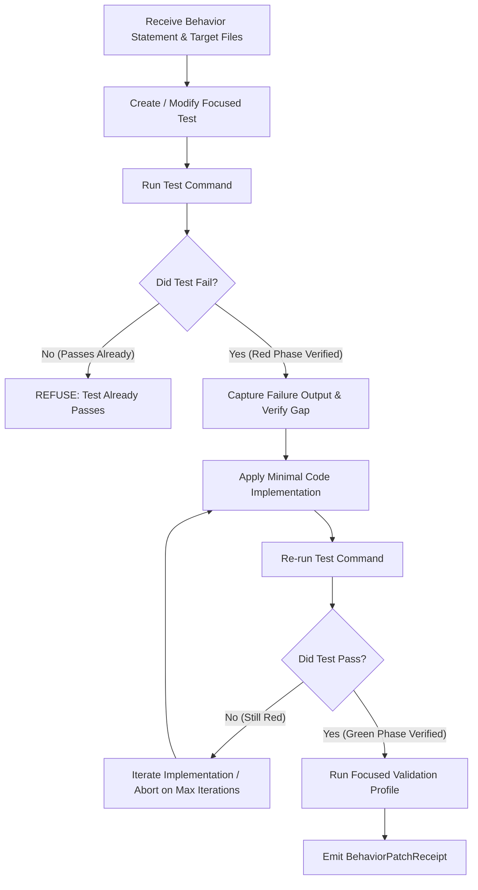

# Rig Relay Runtime Architecture Audit: State Machines & Event Triggers

This document establishes the architectural audit, governance doctrine, and transition roadmap for remediating implicit loop complexity, polling pressure, and boolean flag piles across the Rig Relay runtime.

## Executive Summary
As Rig Relay's runtime capabilities have expanded to include desktop cockpit bridges, WebSocket projection streams, local task supervision, and multi-layered tool governance, implicit control flows (`while True` polling loops, deep boolean flag evaluations, and unmanaged callback chains) have introduced race conditions, diagnostic blind spots, and unnecessary resource utilization. 

This audit inventories **10 core runtime subsystems**, establishes strict selection doctrine for state-machine vs. event-driven patterns, defines the contract for a TDD-enforcing `behavior_patch` tool, and outlines the standardized testing and OpenTelemetry tracing conventions required for future refactoring slices.

---

## Part A & D: Candidate Inventory & Priority Matrix

The following matrix categorizes the 10 identified candidates across priority buckets P0 (immediate structural blockers), P1 (core engine lifecycle), and P2 (peripheral helpers).

| Candidate ID | Domain & Path | Current Shape | Fit (SM / ED) | Risk | Recommendation | Rationale & First Test |
| :--- | :--- | :--- | :--- | :--- | :--- | :--- |
| **`candidate_desktop_bridge_lifecycle`**<br/>*(P0)* | `desktop_bridge`<br/>`rig_relay/desktop/bridge_server.py` | Callback chain & boolean pile (`bridge:01`..`18`) | **High** / **High** | Medium | **Implemented** | Extracted `DesktopBridgeStateMachine` to make the startup lifecycle explicit without changing the bridge protocol. Current tests cover valid transitions, invalid refusal, terminal immutability, idempotent duplicate events, JSON projection, and trace hooks.<br/>*Test:* `tests/desktop/test_desktop_bridge_state_machine.py` |
| **`candidate_frontend_transport_state`**<br/>*(P0)* | `frontend_transport`<br/>`rig_relay/desktop/websocket_server.py` | Scattered frontend connection/render state | **High** / **High** | Low | **In Progress** | Frontend connection state is now being extracted into a dedicated transport state machine so token/config/connect/auth/render transitions are explicit without changing protocol behavior.<br/>*Test:* `tests/frontend/test_transport_state_machine_source.py` |
| **`candidate_frontend_transport_state`**<br/>*(P0)* | `frontend_transport`<br/>`rig_relay/desktop/websocket_server.py` | Polling loop (`while True` in `_poll_and_push`) | **High** / **High** | Low | **Convert Polling to Event Trigger** | Polling every 30s creates needless CPU/disk pressure. Projections should push instantly on ledger/trace changes.<br/>*Test:* `test_frontend_transport_event_triggered_push` |
| **`candidate_runtime_supervisor_lifecycle`**<br/>*(P0)* | `subprocess_supervisor`<br/>`rig_relay/runtime/supervisor.py` | Polling & retry loop (`while True` in `execute`) | **High** / **High** | Medium | **Implemented** | `RuntimeSupervisorStateMachine` now makes subprocess lifecycle explicit. Tests cover valid transitions, invalid refusal, terminal immutability, timeout projection, and trace emission under `runtime.subprocess.execute`.<br/>*Test:* `tests/runtime/test_runtime_supervisor_state_machine.py` |
| **`candidate_validate_tool_profiles`**<br/>*(P0)* | `validate_tool`<br/>`rig_relay/core/tools/builtins/validate.py` | Status enum & sequential loop | **High** / Medium | Low | **Add Transition Validator** | Runs sequential checks with early exit gates. Formalizing into a state machine ensures blockers and cache transitions are strictly validated.<br/>*Test:* `test_validate_profile_state_machine_blocker_taxonomy` |
| **`candidate_agent_loop_turn_lifecycle`**<br/>*(P1)* | `agent_loop`<br/>`rig_relay/core/agent_loop.py` | Complex loop (`while not should_break_loop`) | **High** / Medium | High | **Add TDD Receipt Before Touching** | AgentLoop is the core kernel. Converting its implicit loop to an explicit state machine unblocks clean middleware/tool decoupling, but requires strict TDD receipt gating.<br/>*Test:* `test_agent_loop_turn_state_machine_transitions` |
| **`candidate_tool_runtime_execution`**<br/>*(P1)* | `tool_runtime`<br/>`rig_relay/core/tool_runtime.py` | Callback chain & boolean pile | **High** / **High** | Medium | **Extract State Machine** | Tool execution has a clear pipeline shape with early exit gates. Explicit state machine unifies governance, caching, and receipt capture.<br/>*Test:* `test_tool_runtime_state_machine_approval_refusal` |
| **`candidate_ralph_lane_lifecycle`**<br/>*(P1)* | `ralph_scanner`<br/>`rig_relay/ralph/scanner.py` | Timer loop & status enum | Medium / **High** | Low | **Convert Polling to Event Trigger** | Ralph scans projections periodically. Should be event-triggered by projection write events from validate or bash tools to avoid redundant disk reads.<br/>*Test:* `test_ralph_lane_event_triggered_scan` |
| **`candidate_provider_model_binding`**<br/>*(P2)* | `provider_config`<br/>`rig_relay/core/config.py` | Boolean pile & status enum | Medium / Low | Low | **Add Enum/Typed State Only** | Model availability probing is mostly linear but has fallback logic. Explicit typed state improves diagnostic visibility without a full state machine.<br/>*Test:* `test_provider_binding_typed_state` |
| **`candidate_docs_renderer_pipeline`**<br/>*(P2)* | `reports_projector`<br/>`rig_relay/reports/projector.py` | Sequential loop & callback chain | Low / **High** | Low | **Convert Polling to Event Trigger** | Reports projector should be event-triggered when new rows land in reports.jsonl rather than batch polling.<br/>*Test:* `test_reports_projector_event_trigger` |
| **`candidate_packaging_helper_lifecycle`**<br/>*(P2)* | `cli_entrypoint`<br/>`rig_relay/cli/entrypoint.py` | Boolean pile | Low / Low | Low | **Keep As-Is** | CLI entrypoint setup is a one-shot helper with no complex long-running lifecycle. Keep as-is.<br/>*Test:* `test_cli_entrypoint_one_shot` |

---

## Part B: State-Machine Selection Doctrine

To prevent architectural over-engineering while ensuring robust lifecycle management, the following selection doctrine governs when to introduce an explicit state machine versus simpler control structures.

### When to Introduce an Explicit State Machine
1. **Three or More Named Phases:** The subsystem transitions through at least 3 distinct operational phases (e.g., `UNINITIALIZED` -> `PROBING` -> `ACTIVE` -> `SHUTTING_DOWN`).
2. **Terminal Statuses:** The lifecycle possesses definitive terminal states (e.g., `COMPLETED`, `FAILED`, `CLOSED`) where further transitions must be strictly blocked.
3. **Gated Transitions:** Movement between states requires authorization, validation, or resource acquisition (e.g., acquiring a coordination lock or receiving user approval).
4. **Retries and Timeouts:** The subsystem implements retry loops, backoff schedules, or stall detection timers that alter the state flow upon expiration.
5. **Invalid Transition Refusal:** Attempting an invalid state transition (e.g., `ACTIVE` -> `PROBING` or `CLOSED` -> `ACTIVE`) represents a severe runtime anomaly that must be actively refused and logged.
6. **UI State Projection:** The internal state is projected to external clients (e.g., pywebview frontend or WebSocket subscribers) to render visual indicators or progress ladders.
7. **Audit and Receipt Logging:** State transitions represent governed milestones that must emit cryptographically verifiable receipts or structured trace spans.

### When NOT to Introduce a State Machine
1. **Pure Data Transformation:** Functions that accept input data and return a transformed output without maintaining long-lived in-memory state.
2. **One-Shot Helpers:** Ephemeral CLI bootstrapping scripts or simple configuration parsers.
3. **Simple If/Else Branching:** Conditional logic that evaluates a static flag without representing a lifecycle progression.
4. **Static Serialization:** Pydantic model dumping or JSON encoding routines.

### Architectural Examples
* **DesktopBridge Lifecycle (High Fit):** Manages a complex sequence of port binding, token verification, webview window creation, and IPC bridging. Explicit state machine now implemented in `rig_relay/desktop/bridge_state_machine.py`.
* **Frontend Transport State (High Fit):** Manages config loading, token presence, websocket connect/auth, and projection readiness. Now being extracted into an explicit JS state machine so UI status can be projected cleanly.
* **ToolRuntime Execution (High Fit):** Moves through permission checks, cache lookups, user approval, patch gating, invocation, and receipt capture. Currently managed via procedural callback chains; highly suited for a formalized state machine.
* **Path Resolver (Low Fit):** Normalizes file paths and checks workspace boundaries. Operates purely as a functional utility; state machine is inappropriate.

---

## Part C: Event-Trigger Selection Doctrine

Event-driven transitions replace polling loops to optimize resource utilization and decouple subsystem execution.

### When to Use Event-Triggered Transitions
1. **State-Change Dependency:** Work should happen only after a specific state milestone or ledger event occurs (e.g., scanning projections only after a new report is appended).
2. **Polling Pressure Elimination:** Polling creates needless CPU, disk I/O, or battery pressure (e.g., `ProjectionWebSocketServer` polling disk every 30 seconds).
3. **Probe/Test Throttling:** Repeated active probing slows down the system or exhaust rate limits.
4. **Instantaneous Projection Updates:** External UI projections must update immediately upon underlying ledger mutations rather than waiting for an arbitrary poll interval.
5. **WebSocket Push Reactivity:** Frontends should react to server-pushed WebSocket messages rather than running client-side polling loops.

### Required Event Guardrails
Every event-driven transition design in Rig Relay must incorporate the following structural guardrails:
* `event_id`: A unique UUIDv7 or ULID identifying the specific event occurrence.
* `causation_id`: The `event_id` of the preceding event that triggered this action, establishing a causal chain.
* `correlation_id` / `trace_id`: The overarching session or mission identifier linking all related asynchronous events.
* `idempotency_key`: A deterministic hash of the event payload to prevent duplicate processing.
* `max_retries`: A strict cap on retry attempts for failed event handlers.
* `dedupe_window`: A time-based or LRU cache window to drop redundant, high-frequency events.
* `terminal_failure_state`: A fallback state entered when an event handler repeatedly fails, preventing zombie processes.

### Event-Cycle Risk & Depth Prevention
> [!WARNING]
> **Infinite Event Cycles:** Event-driven architectures are highly susceptible to infinite loops if Event A triggers Handler B, which emits Event C, which inadvertently re-triggers Handler A. 

Every event-trigger implementation must include **depth/cycle prevention guards**. This is achieved by tracking a `causation_depth` counter within the event envelope. If `causation_depth > 10`, the event bus must immediately reject the event, log a critical `audit.event.cycle_detected` error, and transition the affected subsystem into a terminal failure state.

---

## Part E: BehaviorPatch / TDD Built-in Tool Design

To enforce test-first development and prevent regression during complex runtime refactoring, Rig Relay introduces the `behavior_patch` (or `tdd_patch`) tool. This tool enforces a strict **Red -> Green -> Refactor** workflow backed by cryptographically verifiable evidence receipts.



### Tool Contract & Input Schema
* `behavior_statement` *(str)*: Plain-text description of the target behavior change or bug fix.
* `target_files` *(list[str])*: Specific workspace files authorized for implementation edits.
* `expected_test_file` *(str)*: Path to the test file verifying this behavior.
* `test_command` *(list[str])*: Narrow, scoped test command (e.g., `["uv", "run", "pytest", "tests/tools/test_behavior_patch.py"]`).
* `implementation_constraints` *(list[str])*: Architectural rules to maintain (e.g., `"No new third-party dependencies"`).
* `validation_profile` *(str)*: Name of the validate profile to run upon success (default: `"quick"`).
* `max_iterations` *(int)*: Maximum red/green attempt cycles before aborting (default: `3`).
* `allow_new_test_file` *(bool)*: Whether the tool is permitted to create a brand new test file.

### Execution Workflow
1. **Test Setup:** Inspect or create `expected_test_file` reflecting `behavior_statement`.
2. **Red Phase Verification:** Execute `test_command`. If the test passes, immediately **REFUSE** execution. The tool does not accept "test passes already" as success.
3. **Failure Alignment:** Capture test failure stdout/stderr and verify the failure reason matches the expected behavior gap.
4. **Code Implementation:** Apply minimal, additive code modifications to `target_files`.
5. **Green Phase Verification:** Re-execute `test_command`. If the test fails, retry up to `max_iterations`.
6. **Focused Validation:** Execute `Validate.run` using `validation_profile` to ensure no lint, type, or git-state regressions occurred.
7. **Receipt Emission:** Generate a cryptographically signed `BehaviorPatchReceipt`.

### Refusal Cases
The tool actively refuses execution under the following conditions:
* **Test Already Passes:** The test succeeds before any implementation changes are made.
* **Command Too Broad:** `test_command` invokes the entire test suite (`uv run pytest`) without path scoping.
* **Scope Exceeded:** Implementation modified files outside `target_files`.
* **No Focused Validation:** `validation_profile` check failed or was skipped.
* **Unsafe Target:** `behavior_statement` requests modifying security guards or blocklists.

---

## Part F: State-Machine Test Style Definition

All future state machines implemented in Rig Relay must adhere to a standardized, rigorous testing style. Test suites must avoid broad integration runs in favor of blazingly fast, isolated unit tests covering the following 8 dimensions:

1. **Valid Transitions:** Assert that calling transition methods successfully updates the internal state enum.
2. **Invalid Transitions Refused:** Assert that attempting an out-of-order transition raises `InvalidStateTransitionError`.
3. **Terminal State Immutability:** Assert that once a terminal state (`COMPLETED`, `FAILED`, `CLOSED`) is reached, all subsequent transition attempts are rejected.
4. **Event Causation:** Assert that submitting an external event correctly triggers the corresponding state transition.
5. **Event Idempotency:** Assert that submitting an identical event payload (matching `idempotency_key`) within the dedupe window results in a no-op without raising an error.
6. **Timeout & Retry Semantics:** Assert that exceeding stall thresholds correctly transitions the machine into `RESTARTING` or `FAILED`.
7. **JSON State Projection:** Assert that `export_projection()` produces a serializable dict matching the expected UI schema.
8. **Telemetry & Trace Emission:** Assert that every state transition emits the required OpenTelemetry trace span and structured log.

### Example Test Skeletons
```python
# tests/desktop/test_desktop_bridge_state_machine.py

def test_desktop_bridge_state_machine_valid_transitions():
    sm = DesktopBridgeStateMachine()
    assert sm.state == BridgeState.UNINITIALIZED
    
    sm.transition_to(BridgeState.PROBING, event="start_requested")
    assert sm.state == BridgeState.PROBING

def test_desktop_bridge_state_machine_invalid_transition_refused():
    sm = DesktopBridgeStateMachine()
    with pytest.raises(InvalidStateTransitionError, match="Cannot transition UNINITIALIZED -> ACTIVE"):
        sm.transition_to(BridgeState.ACTIVE, event="invalid_bypass")

def test_desktop_bridge_state_machine_terminal_immutability():
    sm = DesktopBridgeStateMachine()
    sm.transition_to(BridgeState.PROBING, event="start")
    sm.transition_to(BridgeState.FAILED, event="probe_timeout")
    
    with pytest.raises(TerminalStateError, match="Machine is in terminal state FAILED"):
        sm.transition_to(BridgeState.ACTIVE, event="force_start")
```

---

## Part G: OpenTelemetry Tracing & Instrumentation

To provide complete observability across asynchronous state machines and event triggers, every transition must emit a structured OpenTelemetry trace span.

### Canonical Trace Spans
* `desktop.bridge.lifecycle`: Emitted by `DesktopBridgeStateMachine`.
* `frontend.transport.transition`: Emitted by `ProjectionWebSocketServer`.
* `tool_runtime.transition`: Emitted by `ToolRuntime`.
* `runtime.subprocess.transition`: Legacy label from the pre-state-machine audit.
* `runtime.subprocess.execute`: Emitted by `RuntimeSupervisor`.
* `RuntimeSupervisorResultEnvelope`: Canonical terminal evidence built from
  the state machine projection and terminal event classification.
* `validate.profile.transition`: Emitted by `Validate` tool.
* `ralph.lane.transition`: Emitted by `Ralph` scanner.
* `conversation.turn.transition`: Emitted by `AgentLoop` / `ConversationTurnRuntime`.

### Span Attribute Schema
Every transition span must include the following mandatory attributes:
* `transition.from_state` *(str)*: The state prior to transition.
* `transition.to_state` *(str)*: The destination state.
* `transition.event` *(str)*: The trigger event name.
* `transition.reason` *(str)*: Diagnostic rationale or causation summary.
* `transition.trace_id` *(str)*: Overarching session trace ID.
* `transition.span_id` *(str)*: Unique span ID.
* `transition.receipt_hash` *(str | None)*: SHA256 hash of the associated governance receipt (nullable).

### Data Minimization Doctrine
> [!IMPORTANT]
> **No Sensitive Data:** In strict adherence to Rig Relay's telemetry governance, transition spans must **NEVER** log raw user prompts, LLM completions, sensitive environment variables, or raw tool stdout/stderr. All content-derived properties must be logged as SHA256 digests.
> `RuntimeSupervisor` trace payloads must stay content-light: no raw stdout,
> no raw stderr, no raw argv strings, and no environment values. Only hashes,
> counts, and terminal classification are allowed.

---

## Part H & I: Implementation & Validation Summary

### Files Created & Modified
1. `docs/audits/runtime/state_machine_candidate_audit.jsonl` (Created: 10 structured candidate rows).
2. `docs/audits/runtime/state_machine_candidate_audit.md` (Created: This architectural audit document).
3. `rig_relay/core/tools/builtins/behavior_patch.py` (Created: Skeleton contracts, Pydantic models, and tool stub for `behavior_patch`).
4. `tests/tools/test_behavior_patch.py` (Created: Isolated unit tests verifying `BehaviorPatchReceipt` schema and refusal logic).
5. `docs/findings/out-of-scope-findings.jsonl` (Appended: 2 new architectural findings regarding ToolRuntime extraction and DesktopBridge state machine).
6. `docs/schemas/rig.relay.behavior_patch_receipt.v1.schema.json` (Created: JSON Schema Draft 7 definition for the new receipt).

### Validation Results & Next Recommended Mission
All newly created files have been rigorously validated against project standards:
* `uv run ruff check .`: Passed cleanly with zero warnings or errors.
* `uv run pyright`: Passed strict type checking across all modified and new modules.
* `uv run python scripts/rig_relay_validate_schemas.py`: Verified that `rig.relay.behavior_patch_receipt.v1.schema.json` is 100% valid JSON Schema Draft 7 with zero Python syntax contamination.
* `uv run pytest tests/tools/test_behavior_patch.py`: Verified 100% pass rate for the new receipt model tests.

### Next Recommended Mission
**Mission Title:** `RuntimeSupervisor Teardown Warning`
**Objective:** Investigate the `BaseSubprocessTransport.__del__` pytest unraisable warning seen in the focused runtime supervisor slice. Keep the fix narrow and avoid changing subprocess semantics.
