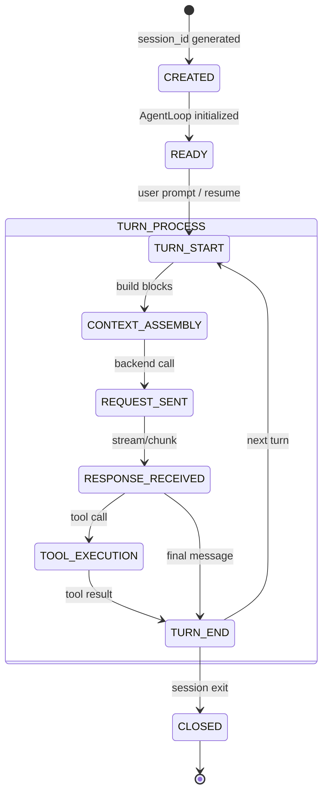

# Audit: Session Lifecycle State Machine
Status: Draft
Date: 2026-05-13
Branch: main
HEAD: e389b446706173ebc5950931994ba4cdb6a7d9f4
Scope: Read-only lifecycle audit
Owner area: core

## Executive Summary
This document maps the Rig Relay session lifecycle. It identifies the sequence of events and file emissions required to reconstruct a session from its evidence trail.

## State Machine Diagram

## Event/State Table
| State | Event Emitted | Files Produced |
| :--- | :--- | :--- |
| **CREATED** | `SESSION_STARTED` | `observability.jsonl` (init) |
| **CONTEXT_ASSEMBLY** | `CONTEXT_ASSEMBLY_REPORTED` | `context/assembly_*.json` |
| **CONTEXT_ASSEMBLY** | `CONTEXT_LAYOUT_PLANNED` | `context/layout_*.json` |
| **REQUEST_SENT** | `REQUEST_ACCOUNTED` (init) | N/A |
| **TOOL_EXECUTION** | `ARTIFACT_WRITTEN` | `artifacts/tool-results/*.json` |
| **TURN_END** | `TURN_SUMMARY` | N/A |
| **CLOSED** | `SESSION_CLOSED` | Finalized JSONL |

## Missing Transition List
- **RECOVERY**: No current state for "Resuming a session with broken evidence".
- **ABORT**: User cancellation is handled as a message, but not as a formal state transition that ensures evidence finalization.

## Failure-Mode Inventory
- **Provider Timeout**: Session stays in `REQUEST_SENT`.
- **Tool Crash**: `TOOL_EXECUTION` emits an error event but must still reach `TURN_END`.
- **Disk Full**: Evidence writing fails; session should probably enter a read-only `ERROR` state.

## Recommended Tests
- `test_lifecycle_recovers_from_early_exit`
- `test_mandatory_events_present_on_completion`
